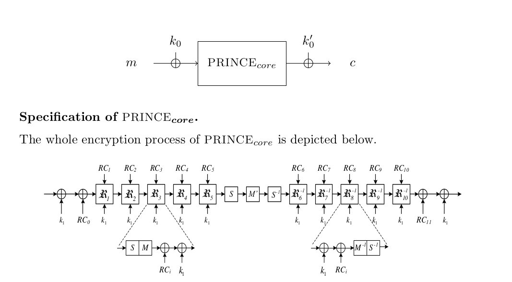

## **Prince Cipher**

#### **Github repository link: https://github.com/srilekhaK9120/PRINCE.git**
### **Team Members - Illuminati**

1. **Chodipilli Yadava Kishore, Id No: 11940310**
2. **Mulukala Vivek, Id No: 11940720**
3. **Srilekha Kadambala, Id No: 11941190**

### **Term Paper**

#### <code>Prince_Cipher_Term_Paper.pdf</code> file contains the term paper.

> In this paper, we have given a detailed description of PRINCE Cipher. We have drawn the motivation after the PRINCE Cipher and also given the detailed
> implementation of PRINCE Cipher. We have also digged into some of the theoretical
> and practical attacks which can be implemented on PRINCE. This cipher is created
> in a way that the overhead for decryption on the top of encryption is minute and
> negligible. Indeed, it holds that decryption for one key parallels to encryption with a related key. This property, we refer to as α-reflection is of independent interest and we demonstrate its robustness against generic attacks.

### **Presentation Slides and Video**

#### <code>Prince_Cipher_Presentation.pdf</code> contains the presentation sldes for project.

- This presentation slides are prepared in latex with the provided template.

#### <code>Presentation Video</code> (@ https://drive.google.com/file/d/1Xd8xJ63dANLc0uJR6roOMia2ghcW6Cxb/view?usp=sharing) contains the video of our presenetation.

### **SBox Analysis**

#### <code>sbox_analysis.ipynb</code> contains the code for prince cipher implementation.

- This file contains the code for sbox analysis both using inbuilt sage functions and in pure python.

### **Software Implementation**

#### <code>software_implementation.ipynb</code> contains the code for prince cipher implementation.

- This file contains the code for encryption and decription using prince cipher.
  -There are two main functions: <code>prince_encrypter</code> and <code>prince_decrypter</code>
- Both functions take an input of 64bit (hexadecial string of length 16) message string along with 128bit (hexadecial string of length 32) key string.

### **Cryptanalysis**

<code>integral_cryptanalysis.ipynb</code> file contains the code for integral attack cryptanalysis.

### **Software Application**
**Read more about this in term paper @ <code>Prince_Cipher_Term_Paper.pdf</code>**

> **FrontEnd :** NextJS (Javascript, React)

#### **How to run front-end:**

#### Go to <code>Software Application @ Crypto/frontend/crypto_cs553</code> folder and run <code>"npm run dev"</code> in the terminal, then go to <code>http://localhost:3000</code>.

> **Backend :** FastAPI (Python framework)

#### **How to run back-end:**

#### Go to <code>Software Application @ Crypto/backend/FastApi</code>" folder and run <code>"uvicorn main:app --reload"</code> in the terminal, then go to <code>http://localhost:8000</code>.

#### To access the visual interface of backend, go to <code>http://127.0.0.1:8000/docs</code>.

> **Requirements : (dependencies)**

**python 3.x**

- <code>pip3 install fastapi uvicorn</code>

**node 16.x or greater**

- run <code>npm init</code> in <code>Software Application @ Crypto/frontend/crypto_cs553</code>
